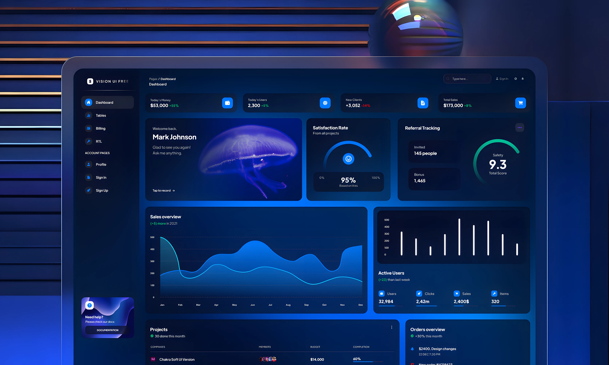

# 🎯 Dashboard - VISION UI
A modern web application dashboard built with React and JavaScript with a
clean and responsive user interface.

------------------------------------------------------------------------

## 👀 Preview

<div align="center">

</div>

<div align="center">
  <span>
    Repo: 
    <a href="https://github.com/SabziDev/visionui-dashboard">GITHUB</a>
  </span>
  <span>|</span>
  <span>
    Live Demo: 
    <a href="#">Live Demo</a>
  </span>
</div>

------------------------------------------------------------------------

## ✨ Features

-   Authentication
-   Displaying data with interactive charts
-   Dual-language panel
-   Skeleton UI Display States
-   Fully responsive design

------------------------------------------------------------------------

## ⚙️ Technologies

-   React
-   React Router
-   TanStack Query
-   i18n
-   Tailwind

------------------------------------------------------------------------

## 📂 Project Structure

``` text
src/
├── components/
├── contexts/
├── hooks/
├── i18n/
├── layouts/
├── pages/
├── services/
├── validators/
├── routes.jsx
├── input.css
```

------------------------------------------------------------------------

## 🚀 Installation

Clone the repository:

``` bash
git clone https://github.com/SabziDev/visionui-dashboard.git
```

Go to the project folder:

``` bash
cd visionui-dashboard
```

Install dependencies:

``` bash
pnpm i
```

Run the project:

``` bash
pnpm dev
```

------------------------------------------------------------------------

## 📦 Dependencies

| Package | Description |
| :--- | :--- |
| react | Core UI library |
| react-router | Client-side routing |
| tanstack-query | Server-state management & caching |
| axios | HTTP API client |
| react-hook-form | Form handling & validation |
| react-hot-toast | Toast notifications |
| framer-motion | Animated-outlet & navigation progress bar |
| recharts | Data visualization charts |
| i18n | Multi-language support (Persian/English) |
| react-loading-skeleton | Skeleton loading placeholders |
| react-spinners | Loading spinners |
| react-indiana-drag-scroll | Drag-to-scroll functionality |
| tailwind | CSS framework |

------------------------------------------------------------------------

## 👨‍💻 Developer

Created by **ABOLFAZL SABZMOHAMMADI**

GitHub: [github.com/SabziDev](https://github.com/SabziDev)
<br />
Website: [SabziDev.com](https://SabziDev.com)
