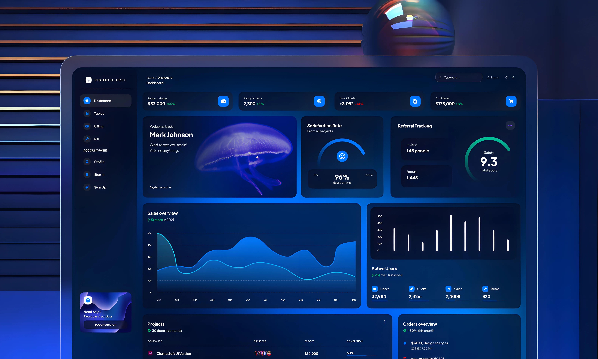

# 🎯 Dashboard - VISION UI

A modern web application dashboard built with React, JavaScript and Tailwind with a
clean and responsive user interface.

---

## 👀 Preview

<div align="center">
  

[GITHUB](https://github.com/SabziDev/visionui-dashboard) | [DEMO](https://sabzidev-visionui-dashboard.vercel.app)
</div>

---

## ⚙️ Technologies

- React
- Tailwind
- React Router
- Axios
- TanStack Query
- i18n
- PWA

---

## ✨ Features

- Authentication
- Displaying data with interactive charts
- Dual-language panel (EN/FA)
- Skeleton UI Display States
- Fully responsive design
- Progressive Web App (PWA) with Web App Manifest, Service Worker caching, and offline capabilities

---

## 📂 Project Structure

```text
src/
├── data/
├── components/
├── hooks/
├── services/
├── validators/
├── contexts/
├── i18n/
├── layouts/
├── pages/
├── input.css
└── routes.jsx
```

---

## 🚀 Installation

Clone the repository:

```bash
git clone https://github.com/SabziDev/visionui-dashboard.git .
```

Install dependencies:

```bash
pnpm i
```

Run the project:

```bash
pnpm dev
```

---

## 📦 Dependencies

| Package                   | Description                       |
| :------------------------ | :-------------------------------- |
| react                     | Core UI library                   |
| tailwind                  | CSS framework                     |
| react-router              | Client-side routing               |
| axios                     | HTTP API client                   |
| tanstack-query            | Server-state management & caching |
| zod                       | Schema validation                 |
| react-hook-form           | Form handling & validation        |
| react-hot-toast           | Toast notifications               |
| i18next                   | Multi-language support            |
| recharts                  | Data visualization charts         |
| react-indiana-drag-scroll | Drag-to-scroll functionality      |
| motion                    | Animation library                 |
| react-loading-skeleton    | Skeleton loading placeholders     |
| react-spinners            | Loading spinners                  |

---

## 👨‍💻 Developer

Developed by **ABOLFAZL SABZMOHAMMADI**

GitHub: [github.com/SabziDev](https://github.com/SabziDev)
<br />
Website: [SabziDev.com](https://Sabzi.Dev)
